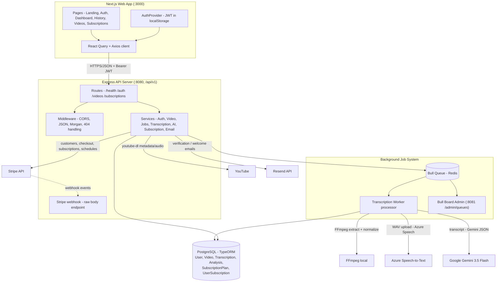
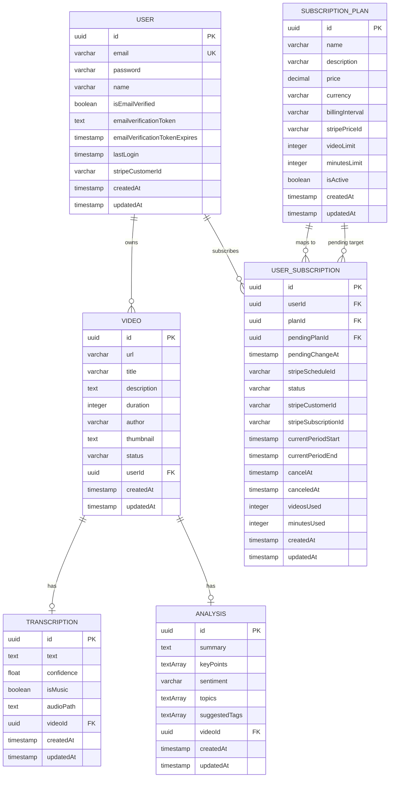
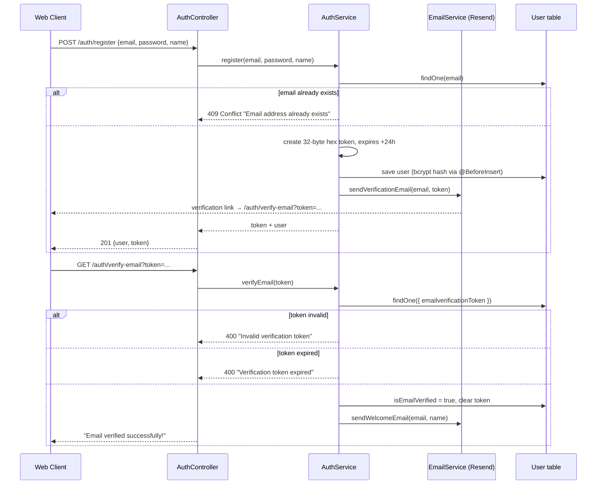
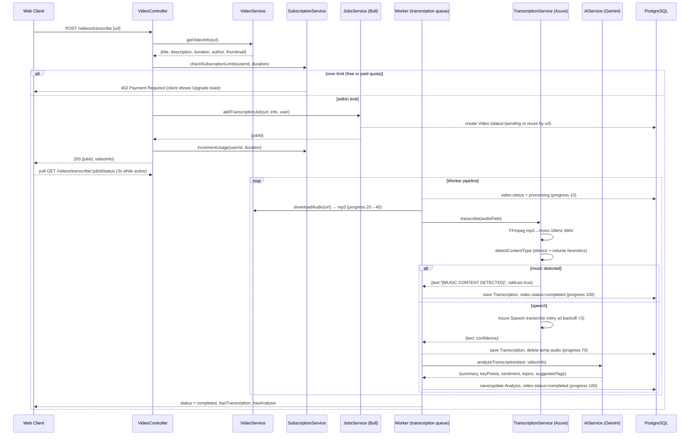
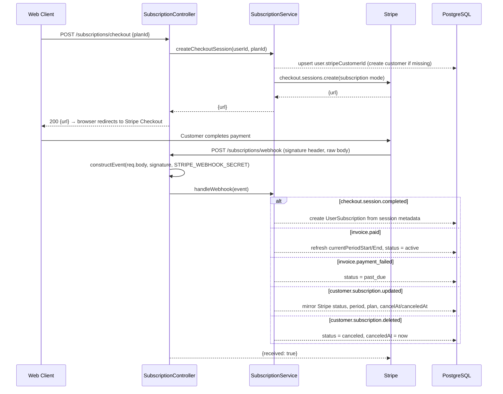
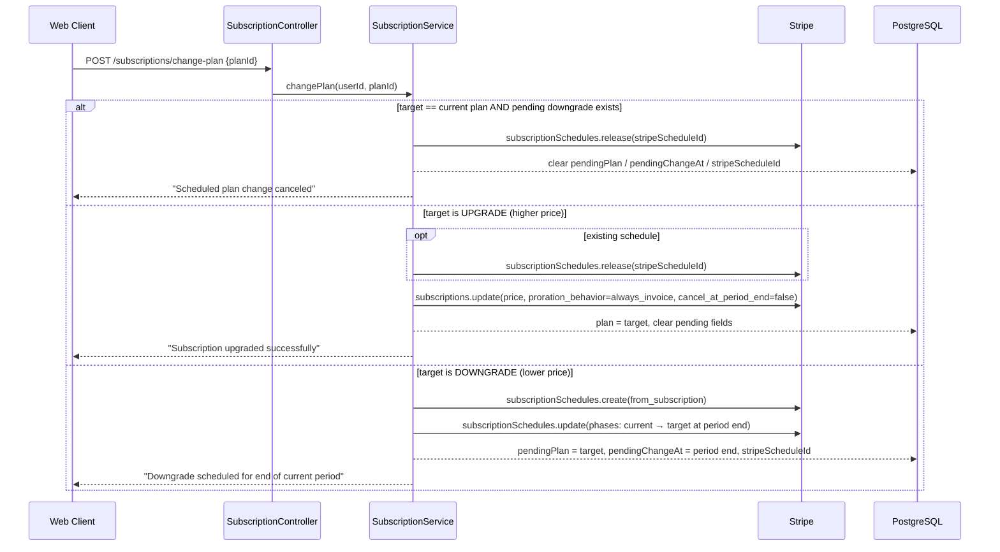
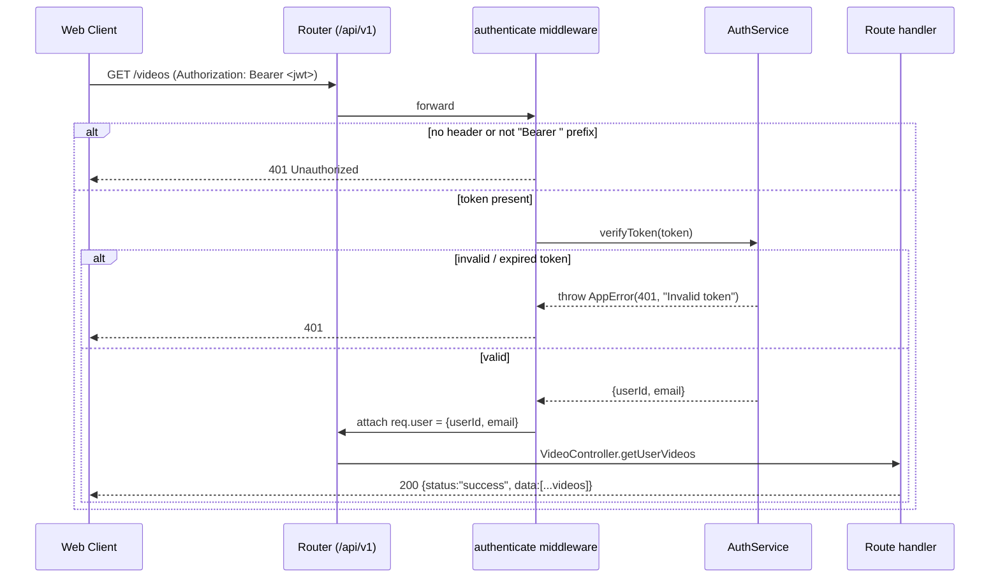

# Clip Note

**Turn YouTube videos into transcripts and AI-generated insights — summaries, key points, sentiment analysis, topics, and tags in minutes.**

Clip Note is a full-stack web application where you paste a YouTube URL and get back an accurate transcript plus an AI analysis of the video's content. Audio is processed asynchronously through a background job pipeline, and usage is gated by a Stripe-powered subscription system with four tiers (Free, Basic, Pro, Business).

---

## Table of Contents

- [Features](#features)
- [Screenshots](#screenshots)
- [Tech Stack](#tech-stack)
- [Architecture Overview](#architecture-overview)
- [Project Structure](#project-structure)
- [Database Schema & Relationships](#database-schema--relationships)
- [Sequence Diagrams](#sequence-diagrams)
- [Environment Variables](#environment-variables)
- [Getting Started](#getting-started)
- [Available Scripts](#available-scripts)
- [Application Routes / API Endpoints](#application-routes--api-endpoints)
- [Business Logic](#business-logic)
- [Access Control](#access-control)
- [Third-Party Integrations](#third-party-integrations)
- [Deployment](#deployment)
- [Key Design Decisions](#key-design-decisions)
- [Seed Data](#seed-data)
- [License](#license)

---

## Features

- **YouTube video metadata extraction** — Given a URL, retrieve the video's title, description, duration, author, and thumbnail via `youtube-dl-exec` (with optional proxy fallback and cookie-based bypass for bot detection).
- **Automatic speech-to-text transcription** — Audio is extracted with FFmpeg, normalized to mono 16 kHz WAV, and transcribed with Azure Speech. Results include a confidence score and a flag for detected music.
- **Music/speech content detection** — Before spending on a transcription call, FFmpeg signal analysis (silence detection + volume measurement) determines whether the file is music or speech. Music files skip AI analysis entirely.
- **AI video analysis (Google Gemini)** — Generates a 2–3 sentence summary, key points, overall sentiment (`positive` / `negative` / `neutral`), topics, and suggested tags from the transcript.
- **Asynchronous job pipeline (Bull + Redis)** — Transcription runs as a background queue job with progress tracking (10% → 100%), exponential backoff retries (3 attempts), job lifecycle cleanup, and real-time status polling via the API.
- **In-progress tracking UI** — The dashboard shows queued/processing jobs with live progress bars and a filterable job history (All / Active / Waiting / Completed / Failed / Delayed).
- **Subscription monetization (Stripe)** — Four seeded plans gated by video count and processing-minutes limits. Supports checkout, immediate upgrades (prorated), scheduled downgrades, cancellation at period end, and resumption.
- **Usage enforcement** — 402 Payment Required responses when a user exceeds their plan's video or minutes quota; the client redirects to the pricing page.
- **Email verification & welcome emails** — Resend-powered verification links (24-hour expiry) and post-verification welcome emails.
- **JWT authentication** — Bearer-token auth with bcrypt password hashing, profile endpoint, and client-side session restore.
- **Bull Board admin dashboard** — A separate admin server (`:8081/admin/queues`) to inspect and control the transcription queue.
- **Versioned REST API** — All endpoints are namespaced under `/api/v1` with a consistent `{ status, data | message }` envelope.

## Screenshots

| Area | Preview |
| --- | --- |
| Landing page |  |
| Dashboard / video submission |  |
| Video history / progress |  |
| Video history / progress |  |
| Video detail (transcript + analysis) |  |
| Video detail (transcript + analysis) |  |
| Pricing / subscriptions |  |
| Subscription management |  |

---

## Tech Stack

### Backend — `server/`

| Layer | Technology | Version |
| --- | --- | --- |
| Runtime | Node.js | `>= 20` (from `engines`) |
| Language | TypeScript | `5.8.3` |
| Web framework | Express | `5.2.1` |
| ORM | TypeORM | `1.1.0` |
| Database | PostgreSQL (`pg` driver) | `8.23.0` |
| Job queue | Bull | `4.16.5` |
| Queue admin | Bull Board (`@bull-board/api` / `@bull-board/express`) | `9.4.0` |
| Payments | Stripe SDK | `22.6.0` |
| Speech transcription | Azure `@azure/ai-speech-transcription` | `1.0.0` |
| AI analysis | Google Gemini (`@google/generative-ai`) | `0.24.1` |
| Emails | Resend | `6.22.0` |
| YouTube download | `youtube-dl-exec` | `3.1.12` |
| YouTube metadata | `ytdl-core` | `4.11.5` |
| Media processing | `fluent-ffmpeg` (+ `@ffmpeg-installer/ffmpeg`) | `2.1.3` / `1.1.0` |
| Auth / hashing | `jsonwebtoken` / `bcrypt` | `9.0.3` / `6.0.0` |
| Logging | Winston (+ Morgan HTTP log) | `3.19.0` / `1.11.0` |
| Validation | `validator` | `13.15.35` |
| Utility | `cors`, `dotenv`, `http-status-codes` | `2.8.6` / `17.4.2` / `2.3.0` |
| Dev tooling | `tsx`, `nodemon`, ESLint + `@typescript-eslint` | `4.23.12` / `3.1.14` / `8.x` |

> Note: `@google-cloud/speech` and `@google-cloud/storage` are declared dependencies but are **not** imported anywhere in the source; transcription is performed with Azure and analysis with Gemini.

### Frontend — `client/`

| Layer | Technology | Version |
| --- | --- | --- |
| Framework | Next.js (App Router) | `16.3.3` |
| UI library | React / React DOM | `19.2.8` |
| Data fetching | TanStack React Query | `5.102.7` |
| HTTP client | Axios | `1.20.0` |
| Forms | React Hook Form + Zod | `7.86.0` / `3.25.76` |
| Form resolvers | `@hookform/resolvers` | `5.9.1` |
| Styling | Tailwind CSS | `4.3.3` (declared `^4`) |
| UI components | shadcn/ui style + Base UI + Radix primitives | `shadcn@4.19.0`, `@base-ui/react@1.7.0` |
| Icons | Lucide React | `1.34.0` |
| Notifications | Sonner | `2.0.8` |
| Theme | `next-themes` | `0.4.6` |
| Utilities | `clsx`, `tailwind-merge`, `class-variance-authority` | `2.1.1` / `3.6.0` / `0.7.1` |
| Language | TypeScript | `5.9.3` |

---

## Architecture Overview



**Data flow (high level):**

1. The client submits a YouTube URL to `POST /api/v1/videos/transcribe`.
2. The API fetches video metadata, validates subscription limits, enqueues a Bull job, and immediately responds with a `jobId`.
3. The Bull worker downloads the audio, converts it to a normalized WAV, detects whether it is music or speech, and (for speech) calls Azure Speech to get a transcript.
4. If the video is not music, the transcript is sent to Gemini for analysis (summary, key points, sentiment, topics, tags).
5. Results are persisted as `Video`, `Transcription`, and `Analysis` rows; the client polls the job status endpoint until completion.

---

## Project Structure

```
clip-note/
├── client/                      # Next.js 16 frontend (:3000)
│   ├── app/
│   │   ├── layout.tsx           # Root layout: fonts, providers, global Toaster
│   │   ├── page.tsx             # Public landing page
│   │   ├── providers.tsx        # Providers split for RSC
│   │   └── providers/
│   │       └── client-providers.tsx  # QueryClient + AuthProvider ("use client")
│   │   ├── (auth)/auth/         # Auth route group (redirects logged-in users)
│   │   │   ├── login/           #   /auth/login
│   │   │   ├── register/        #   /auth/register
│   │   │   └── verify-email/    #   /auth/verify-email?token=...
│   │   └── (main)/              # Authenticated route group (redirects anonymous users)
│   │       └── dashboard/       #   /dashboard (submit URL), /videos, /videos/:id,
│   │       │                    #   /history, /history/:id, /profile
│   │       └── subscriptions/   #   /, /manage, /success, /cancel
│   ├── components/
│   │   ├── ui/                  # shadcn/ui primitives (button, card, form, ...)
│   │   ├── auth/                # login-form, signup-form, verify-email-form
│   │   ├── dashboard/           # video-submission-form, in-progress-preview,
│   │   │                        # video-history, job-card, my-video, video-detail,
│   │   │                        # history-detail, sidebar-nav, sidebar-subscription-widget
│   │   ├── landing/             # pricing-preview
│   │   └── icons/               # Youtube brand icon
│   ├── lib/
│   │   ├── api/                 # Axios client + typed API modules (auth, videos, subscription)
│   │   ├── hooks/               # AuthProvider + useAuth / useRequireAuth
│   │   │   └── queries/         # React Query hooks (auth, videos, subscriptions)
│   │   ├── validations/         # Zod schemas (auth, videos)
│   │   └── utils.ts             # cn() tailwind-merge helper
│   ├── public/                  # static assets, favicons, logo, manifest
│   ├── next.config.ts           # image remote patterns (i.ytimg.com), dev origins
│   ├── postcss.config.mjs
│   ├── components.json          # shadcn config
│   ├── tsconfig.json            # path alias @/*
│   ├── eslint.config.mjs
│   └── package.json
│
├── server/                      # Express 5 + TypeORM backend (:8080)
│   ├── src/
│   │   ├── index.ts             # App bootstrap: DB init, plan seeding, job service,
│   │   │                        #   Bull Board admin, CORS, routes, error/404 handlers
│   │   ├── config/
│   │   │   ├── env.ts           # dotenv loader
│   │   │   └── database.ts      # TypeORM DataSource (PostgreSQL, synchronize in dev)
│   │   ├── entities/            # TypeORM entities
│   │   │   ├── user.entity.ts
│   │   │   ├── video.entity.ts
│   │   │   ├── transcription.entity.ts
│   │   │   ├── analysis.entity.ts
│   │   │   ├── subscription-plan.entity.ts
│   │   │   └── user-subscription.entity.ts
│   │   ├── routes/              # Express routers (mounted under /api/v1)
│   │   │   ├── index.ts
│   │   │   ├── health.routes.ts
│   │   │   ├── auth.routes.ts
│   │   │   ├── video.route.ts
│   │   │   └── subscription.routes.ts
│   │   ├── controller/          # Thin HTTP layer -> services
│   │   │   ├── auth.controller.ts
│   │   │   ├── video.controller.ts
│   │   │   └── subscription.controller.ts
│   │   ├── services/            # Business logic
│   │   │   ├── auth.service.ts          # register/login/verify, JWT, bcrypt
│   │   │   ├── email.service.ts         # Resend verification + welcome emails
│   │   │   ├── video.service.ts         # youtube-dl info/download, proxy fallback
│   │   │   ├── transcription.service.ts # FFmpeg WAV, music detection, Azure Speech
│   │   │   ├── ai.service.ts            # Gemini analysis with JSON contract
│   │   │   ├── jobs.service.ts          # Bull queue, worker pipeline, job status
│   │   │   └── subscription.service.ts  # Stripe checkout/webhooks, limits, plans
│   │   ├── middleware/
│   │   │   ├── auth.middleware.ts       # Bearer JWT guard
│   │   │   ├── validateUrl.ts           # YouTube URL regex guard
│   │   │   └── subscription.middleware.ts # requiresSubscription(tier) - not yet wired to routes
│   │   ├── seed/
│   │   │   └── subscription-plans.seed.ts # Idempotent plan seeding on startup
│   │   ├── templates/emails/    # HTML email templates (base, verification, welcome)
│   │   ├── utils/
│   │   │   ├── errors.ts        # AppError + operational error handler
│   │   │   ├── response.ts      # successResponse / errorResponse envelope
│   │   │   └── logger.ts        # Winston (console in dev, file transports always)
│   │   └── test-connection.ts   # Developer PG connectivity smoke test
│   ├── temp/audio/              # Scratch space for downloaded/converted audio
│   ├── logs/                    # Winston output (error.log, combined.log)
│   ├── docker-compose.yml       # Local PostgreSQL + Redis
│   ├── tsconfig.json            # NodeNext ESM, decorators for TypeORM
│   ├── eslint.config.mjs
│   └── package.json
│
├── rest-client/                 # REST Client scripts for manual API testing
│   ├── auth.http
│   └── videos.http
├── LICENSE                      # MIT
└── .gitignore
```

---

## Database Schema & Relationships

The schema is defined entirely by the TypeORM entities in `server/src/entities/` (there are no migration files — tables are created with `synchronize: true` in development). All primary keys are UUIDs.

### Entities

| Entity | Description | Key fields |
| --- | --- | --- |
| `User` | Application user account. Password is bcrypt-hashed (salt rounds 10) via `@BeforeInsert`/`@BeforeUpdate`. | `id` (uuid PK), `email` (unique), `password`, `name`, `isEmailVerified`, `emailverificationToken`, `emailVerificationTokenExpires`, `lastLogin`, `stripeCustomerId` |
| `Video` | A submitted YouTube video. `status` moves `pending → processing → completed|failed`. | `id`, `url`, `title`, `description`, `duration`, `author`, `thumbnail`, `status`, `user`, `transcription`, `analysis` |
| `Transcription` | The transcript produced by Azure Speech. | `id`, `text`, `confidence` (float), `isMusic` (bool), `audioPath`, `video` (1:1) |
| `Analysis` | The Gemini-derived insight for a video. | `id`, `summary`, `keyPoints` (text[]), `sentiment` (enum), `topics` (text[]), `suggestedTags` (text[]), `video` (1:1) |
| `SubscriptionPlan` | A purchasable tier with usage quotas. Seeded at startup. | `id`, `name`, `description`, `price` (decimal 10,2), `currency`, `billingInterval`, `stripePriceId`, `videoLimit`, `minutesLimit`, `isActive` |
| `UserSubscription` | A user's current (or pending) paid subscription, mirroring Stripe state. | `id`, `user`, `plan`, `pendingPlan` (nullable), `pendingChangeAt`, `stripeScheduleId`, `status` (enum), `stripeCustomerId`, `stripeSubscriptionId`, `currentPeriodStart`, `currentPeriodEnd`, `cancelAt`, `canceledAt`, `videosUsed`, `minutesUsed` |

### ER Diagram



### Relationships

| From | To | Type | Description |
| --- | --- | --- | --- |
| `User` | `Video` | 1 — N | Every video belongs to a single user. |
| `User` | `UserSubscription` | 1 — N | A user can have multiple subscription records over time; lookup targets the latest `active` one. |
| `Video` | `Transcription` | 1 — 1 | `Transcription.video` holds the `@JoinColumn`; a video has at most one transcript. |
| `Video` | `Analysis` | 1 — 1 | `Analysis.video` holds the `@JoinColumn`; a video has at most one analysis (skipped when content is music). |
| `SubscriptionPlan` | `UserSubscription` | 1 — N | The plan the subscription was created for. |
| `SubscriptionPlan` | `UserSubscription` | 1 — N (nullable) | `pendingPlan` — the downgrade plan scheduled to take effect at the end of the current period. |

---

## Sequence Diagrams

### 1. Registration & email verification



### 2. Video transcription job (core flow)



### 3. Stripe checkout & webhook lifecycle



### 4. Plan change — upgrade vs scheduled downgrade



### 5. Authentication guard & routing



---

## Environment Variables

### Server (`server/.env`)

| Variable | Required | Description |
| --- | --- | --- |
| `PORT` | No | HTTP port for the API (default `8080`). |
| `ADMIN_PORT` | No | Port for the Bull Board admin server (default `8081`). |
| `NODE_ENV` | No | `development` / `production`; enables typeorm `synchronize` in dev. |
| `DB_HOST` | Yes | PostgreSQL host. |
| `DB_PORT` | Yes | PostgreSQL port (default `5432`). |
| `DB_USERNAME` | Yes | PostgreSQL user. |
| `DB_PASSWORD` | Yes | PostgreSQL password. |
| `DB_DATABASE` | Yes | PostgreSQL database name. |
| `DB_SSL` | No | `true` to enable SSL with `rejectUnauthorized: false` (e.g. Neon). |
| `FRONTEND_URL` | Yes | Client origin used for CORS and verification-email links. |
| `CLIENT_URL` | Yes | Base URL used in Stripe success/cancel redirects. |
| `REDIS_HOST` | Yes | Redis host for the Bull queue. |
| `REDIS_PORT` | Yes | Redis port (default `6379`). |
| `REDIS_USERNAME` | No | Redis username (default `default`). |
| `REDIS_PASSWORD` | No | Redis password. |
| `REDIS_TLS` | No | `true` to enable TLS connection (e.g. Upstash). |
| `RESEND_API_KEY` | Yes | Resend API key for verification/welcome emails. |
| `JWT_SECRET` | Yes | Secret used to sign JWT access tokens. |
| `JWT_EXPIRES_IN` | No | Token lifetime (default `24h`). |
| `AZURE_SPEECH_ENDPOINT` | Yes | Azure Speech service endpoint. |
| `AZURE_SPEECH_KEY` | Yes | Azure Speech access key. |
| `SPEECH_TO_TEXT_LANGUAGE` | No | Transcription locale (default `en-US`). |
| `GOOGLE_API_KEY` | Yes | Google/Gemini API key for AI analysis. |
| `STRIPE_SECRET_KEY` | Yes | Stripe secret key. |
| `STRIPE_WEBHOOK_SECRET` | Yes | Stripe webhook signing secret. |
| `YT_COOKIES_FILE` | No | Path to a Netscape-format cookies file to bypass YouTube bot detection. |
| `YT_COOKIES_FROM_BROWSER` | No | Browser name to export cookies from (youtube-dl option). |
| `YT_PROXY_URL` | No | Proxy URL for youtube-dl requests. |
| `YT_PROXY_FIRST` | No | `true` to try the proxy before the direct connection. |
| `YT_EXTRACTOR_ARGS` | No | Extra extractor arguments passed to youtube-dl. |
| `GOOGLE_APPLICATION_CREDENTIALS` | No | Path to GCP service account JSON (declared but unused in current code paths). |

### Client (`client/.env`)

| Variable | Required | Description |
| --- | --- | --- |
| `NEXT_PUBLIC_BACKEND_URL` | Yes | Base URL of the backend API, e.g. `http://localhost:8080`. The Axios client appends `/api/v1`. |

### `server/.env.example`

```bash
# Server
PORT=8080
ADMIN_PORT=8081
NODE_ENV=development

# Database
DB_HOST=127.0.0.1
DB_PORT=5432
DB_USERNAME=postgres
DB_PASSWORD=postgres
DB_DATABASE=clip-note-db
DB_SSL=false

# Resend
RESEND_API_KEY=re_xxxxxxxxxxxx
FRONTEND_URL=http://localhost:3000
CLIENT_URL=http://localhost:3000

# Redis
REDIS_HOST=127.0.0.1
REDIS_PORT=6379
REDIS_USERNAME=default
# REDIS_PASSWORD=
# REDIS_TLS=true

# Azure Speech
AZURE_SPEECH_ENDPOINT=https://<region>.api.cognitive.microsoft.com
AZURE_SPEECH_KEY=<azure_key>
# SPEECH_TO_TEXT_LANGUAGE=en-US

# Google Gemini
GOOGLE_API_KEY=<gemini_api_key>

# Stripe
STRIPE_SECRET_KEY=sk_test_xxx
STRIPE_WEBHOOK_SECRET=whsec_xxx

# JWT
JWT_SECRET=change-me
JWT_EXPIRES_IN=24h

# YouTube (optional)
# YT_COOKIES_FILE=./cookies.txt
# YT_COOKIES_FROM_BROWSER=chrome
# YT_PROXY_URL=http://proxy:8080
# YT_PROXY_FIRST=false
# YT_EXTRACTOR_ARGS=
```

### `client/.env.example`

```bash
NEXT_PUBLIC_BACKEND_URL=http://localhost:8080
```

---

## Getting Started

### Prerequisites

- **Node.js >= 20** (required by `server/package.json` `engines`).
- **PostgreSQL** — use the included `docker-compose.yml`, a local install, or a hosted service (e.g. Neon).
- **Redis** — required by the Bull job queue (use `docker-compose.yml`, a local install, or Upstash).
- **FFmpeg** — bundled at runtime by `@ffmpeg-installer/ffmpeg`, so no system install is required.
- **External accounts**: Azure Speech, Google Gemini API key, Resend, and Stripe (test mode) are needed for full functionality; the API will still boot without them but the corresponding features will fail.

> **Note:** Because this project uses environment-variable-driven `synchronize: true` in development only, TypeORM creates/updates tables automatically — no `npm run db:migrate` step exists.

### Installation

**1. Clone the repository and install dependencies**

```bash
git clone <repo-url> clip-note
cd clip-note

cd server
npm install

cd ../client
npm install
```

**2. Start local infrastructure (PostgreSQL + Redis)**

```bash
cd server
docker compose up -d
```

**3. Configure environment variables**

```bash
# Server
cp server/.env.example server/.env      # then fill in real keys
# Client
cp client/.env.example client/.env      # NEXT_PUBLIC_BACKEND_URL=http://localhost:8080
```

**4. Run the backend**

The server initializes in this order: database connection → idempotent seeding of subscription plans → Bull job service → Stripe/Subscription service → Bull Board admin (`:8081`) → main API (`:8080`).

```bash
cd server
npm run dev
```

**5. Run the frontend**

```bash
cd client
npm run dev
```

Open http://localhost:3000, register an account, verify your email, and paste a YouTube URL on the dashboard.

### Setting up external services

- **Stripe webhook**: point a Stripe webhook at `https://<host>/api/v1/subscriptions/webhook` with the events `checkout.session.completed`, `invoice.paid`, `invoice.payment_failed`, `customer.subscription.updated`, and `customer.subscription.deleted`. Use the signing secret as `STRIPE_WEBHOOK_SECRET`. The success/cancel return URLs are `${CLIENT_URL}/subscriptions/success` and `${CLIENT_URL}/subscriptions/cancel`.
- **Stripe prices**: the seeded plans reference hard-coded Stripe `price_` IDs in `server/src/seed/subscription-plans.seed.ts` — create matching prices in your Stripe account (or edit the seed file) before testing checkout.
- **YouTube scraping**: if you hit YouTube bot detection (`"Sign in to confirm you're not a bot"`), configure `YT_COOKIES_FILE` / `YT_COOKIES_FROM_BROWSER` and optionally `YT_PROXY_URL`.

### Testing the API without the UI

Requests are pre-written as REST Client files under `rest-client/` (`auth.http`, `videos.http`) and can be run from VS Code's **REST Client** extension against `http://localhost:8080/api/v1`.

---

## Available Scripts

### Server (`server/`)

| Script | Command | Description |
| --- | --- | --- |
| `start` | `node dist/index.js` | Run the compiled production build (must run `build` first). |
| `dev` | `nodemon --exec tsx src/index.ts` | Run in watch mode with tsx (no compile step). |
| `build` | `tsc` | Compile TypeScript to `dist/` (NodeNext ESM output with declarations). |

### Client (`client/`)

| Script | Command | Description |
| --- | --- | --- |
| `dev` | `next dev` | Start the Next.js development server (port 3000). |
| `build` | `next build` | Create a production build. |
| `start` | `next start` | Serve the production build. |
| `lint` | `eslint` | Run ESLint over the project. |

---

## Application Routes / API Endpoints

### Frontend routes (`client/`)

| Route | Auth | Description |
| --- | --- | --- |
| `/` | Public | Landing page with hero, features, how-it-works, pricing preview, and CTA. |
| `/auth/login` | Guest only | Login form (redirects logged-in users to `/dashboard`). |
| `/auth/register` | Guest only | Registration form with password confirmation. |
| `/auth/verify-email` | Public | Handles the emailed verification link (`?token=`). |
| `/dashboard` | Required | "New Video" — submit a YouTube URL and see in-progress jobs. |
| `/dashboard/videos` | Required | "My Videos" — list of the user's processed videos. |
| `/dashboard/videos/[id]` | Required | Single video detail (transcript + AI analysis). |
| `/dashboard/history` | Required | "Progress" — job history with status filter. |
| `/dashboard/history/[id]` | Required | Single job detail. |
| `/dashboard/profile` | Required | Profile page. |
| `/subscriptions` | App context | Pricing cards (paid plans only; Free shown as default state). |
| `/subscriptions/manage` | Required | Current plan, usage progress bars, cancel/resume, pending downgrade notice. |
| `/subscriptions/success` | Public | Post-checkout confirmation (invalidates subscription query). |
| `/subscriptions/cancel` | Public | Checkout cancellation landing page. |

### API endpoints (`server/`, prefix `/api/v1`)

| Method | Endpoint | Auth | Description |
| --- | --- | --- | --- |
| `GET` | `/health` | None | Liveness probe: `{status:"ok", timestamp, environment}`. |
| `POST` | `/auth/register` | None | Create account, bcrypt-hash password, send verification email, return `{user, token}`. |
| `POST` | `/auth/login` | None | Verify credentials, update `lastLogin`, return `{user, token}`. |
| `GET` | `/auth/verify-email` | None | `?token=` — verify email, clear token, send welcome email. |
| `POST` | `/auth/resend-verification` | None | Issue a new 24-hour verification token and re-send email. |
| `GET` | `/auth/me` | Bearer JWT | Return the current user profile (with `videos` relation). |
| `GET` | `/videos` | Bearer JWT | List the user's videos (newest first) with transcription and analysis. |
| `GET` | `/videos/:id` | Bearer JWT | Single video with transcription/analysis (scoped to the user). |
| `GET` | `/videos/transcribe/:jobId/status` | Bearer JWT | Job state, progress %, result, failure reason, attempts, and derived `videoStatus`. |
| `POST` | `/videos/info` | Bearer JWT | `{url}` — return YouTube metadata only (URL validated). |
| `POST` | `/videos/diagnose` | Bearer JWT | `{url}` — best-effort diagnostics; returns `{ok:false}` + raw message instead of throwing. |
| `POST` | `/videos/audio` | Bearer JWT | `{url}` — download audio to `temp/audio/<videoId>.mp3`, return path + metadata. |
| `POST` | `/videos/transcribe` | Bearer JWT | `{url}` — enforce limits, enqueue job, increment usage, return `{jobId, videoInfo}`. |
| `POST` | `/videos/jobs/running` | Bearer JWT | Aggregate the user's active/waiting/completed/delayed/failed Bull jobs, newest first. |
| `GET` | `/subscriptions/plans` | None | Active plans ordered by price ascending. |
| `GET` | `/subscriptions/plans/:id` | None | Single plan. |
| `POST` | `/subscriptions/webhook` | Stripe signature | Raw-body Stripe webhook: sets up subscriptions, syncs status/periods/plans. |
| `GET` | `/subscriptions/me` | Bearer JWT | Current active subscription with plan + pending plan. 404 if none. |
| `POST` | `/subscriptions/checkout` | Bearer JWT | `{planId}` — create Stripe checkout session, return `{url}` (fails if an active subscription exists). |
| `POST` | `/subscriptions/change-plan` | Bearer JWT | `{planId}` — upgrade immediately (prorated) or schedule a downgrade. |
| `POST` | `/subscriptions/cancel` | Bearer JWT | Set `cancel_at_period_end`; access continues until period end. |
| `POST` | `/subscriptions/resume` | Bearer JWT | Clear the pending cancellation. |
| `GET` | `/subscriptions/usage` | Bearer JWT | `{videosUsed, videoLimit, minutesUsed, minutesLimit, planName}` for free or paid tier. |

Response envelope: `{ status: "success", data }` on success; `{ status: "error", message }` on failure (the `error` field is appended in development only). Unmatched routes return 404, and unhandled errors pass through the centralized `handleError` middleware.

---

## Business Logic

### Authentication & verification

- Registration rejects duplicate emails (409), stores the password hashed with bcrypt (the entity's `@BeforeInsert`/`@BeforeUpdate` hook avoids double-hashing by checking the stored hash length), and issues a 24-hour email-verification token.
- A verification email with a `FRONTEND_URL/auth/verify-email?token=...` link is sent through Resend. Verifying marks the account, clears the token, and triggers a welcome email. `resendVerificationEmail` regenerates the token for unverified accounts.
- Login upserts `lastLogin` and returns a signed JWT carrying `{userId, email}` with a configurable expiry (default 24h).

### Video processing pipeline (`VideoService` + `JobsService` + `TranscriptionService` + `AIService`)

1. `POST /videos/transcribe` fetches metadata, validates the user's plan limits (`checkSubscriptionLimits`), and enqueues a Bull job. A `Video` row is created (or reused by URL) with `status = "pending"`.
2. The worker advances a progress bar (10 → 20 → 40 → 70 → 100) as it: refreshes metadata → downloads MP3 audio with `youtube-dl-exec` → converts to a mono 16 kHz PCM WAV with FFmpeg → runs a music/speech heuristic (silence duration + `max_volume` ratio) → calls Azure Speech (with up to 3 exponential-backoff attempts).
3. Music content short-circuits: the transcript is a placeholder and analysis is skipped. Otherwise the transcript (with averaged per-phrase confidence) is saved and passed to Gemini, which is prompted to return a strict JSON object; parsing is hardened with a JSON-extraction regex and a white-list sentiment fallback to `neutral`.
4. Transcriptions and analyses are upserted against existing rows for re-run scenarios; interim audio files are always cleaned up (success or failure). Fatal errors (no speech, private/unavailable video) stop processing with `final: true` rather than retrying; otherwise the Bull default of 3 attempts with exponential backoff applies, and a failed job sets `video.status = "failed"`.
5. The client polls `GET /videos/transcribe/:jobId/status` every 3 seconds while the job is `waiting`/`active` and stops once completed or failed.

### Subscription lifecycle

- **Plans** are seeded idempotently on startup: Free ($0), Basic ($4.99), Pro ($14.99), Business ($39.99) — all monthly, with video and minutes quotas (see [Seed Data](#seed-data)). Only `isActive` plans are exposed.
- **Checkout** requires no existing active subscription (409 otherwise); a Stripe customer is lazily created for the user and the checkout session carries the `userId`/`planId` metadata used by the webhook to materialize the `UserSubscription`.
- **Plan changes** are asymmetric: upgrades are applied immediately with proration (`always_invoice`, and any pending downgrade schedule is released), while downgrades are staged through a Stripe subscription schedule with two phases so the current price stays until period end (`pendingPlan` + `pendingChangeAt` are stored locally). Requesting the same plan cancels any pending change.
- **Cancel/Resume**: cancellation sets `cancel_at_period_end: true`; users keep access to the end of the billing period. Resuming clears it. `customer.subscription.deleted` marks the record `canceled`.
- **Invoice events**: `invoice.paid` refreshes the current period and sets `active`; `invoice.payment_failed` marks the subscription `past_due` so access can be gated.

### Usage limits

- `checkSubscriptionLimits` caps work for free users against the seeded "Free" plan (counting all of the user's videos/minutes) and for paid users against `videosUsed`/`minutesUsed` on the active subscription. Violations bubble up as 402 status codes; the client catches 402 and prompts an upgrade.
- Each accepted job increments `videosUsed` by 1 and `minutesUsed` by `ceil(durationSeconds / 60)` — the same rounding used by the limit checks.

---

## Access Control

There is no role-based authorization — access is determined by **authentication state** plus the user's **subscription entitlement** (which is enforced in `VideoController.transcribeVideo` via limits, not on the routes).

| Route group | Anonymous | Authenticated (free tier) | Authenticated (paid plan) |
| --- | --- | --- | --- |
| `/health` | Allowed | Allowed | Allowed |
| `/auth/*` | Allowed (register/login/verify/resend) | `/auth/me` requires JWT | `/auth/me` requires JWT |
| `/videos/*` | 401 | Allowed, limited by Free plan (3 videos / 30 min) | Allowed, limited by plan quota |
| `/subscriptions/plans` | Allowed | Allowed | Allowed |
| `/subscriptions/webhook` | Stripe signature only | Stripe signature only | Stripe signature only |
| `/subscriptions/{me,checkout,change-plan,cancel,resume,usage}` | 401 | Allowed (no active subscription → 404 on `/me`) | Allowed |

### Resource access rules

| Resource | Read | Create | Update | Delete |
| --- | --- | --- | --- | --- |
| `User` | Self only (`auth/me`) | Via register | Via login (`lastLogin`) | Not exposed |
| `Video` | Owner only (`getUserVideos`, `getVideoById` are scoped by `user.id`) | Via `/videos/transcribe` (deduped by URL) | Job worker (status/metadata) | Not exposed |
| `Transcription` / `Analysis` | Read through owner's video | Job worker | Job worker (upsert on re-run) | Not exposed |
| `SubscriptionPlan` | Public read | Seed script only | Not exposed | Not exposed |
| `UserSubscription` | Owner only (`/subscriptions/me`, `/usage`) | Via checkout + webhook | Via change-plan/cancel/resume + webhook | Only via `customer.subscription.deleted` |

---

## Third-Party Integrations

| Integration | What it does | How it's used |
| --- | --- | --- |
| **YouTube (youtube-dl-exec + ytdl-core)** | Extracts video metadata and downloads audio. | `VideoService` shells out to `youtube-dl-exec` with `dumpSingleJson` for info and `extractAudio` (MP3, best quality) for audio. Requests try the direct connection first and fall back to `YT_PROXY_URL` (invert with `YT_PROXY_FIRST`). `ytdl-core` derives the fallback thumbnail and video ID. |
| **Azure Speech (`@azure/ai-speech-transcription`)** | Batch speech-to-text. | `TranscriptionService` uploads the normalized WAV, requests the configured locale, and averages phrase confidences. Calls retried up to 3× with linear backoff. |
| **Google Gemini (`@google/generative-ai`)** | AI content analysis. | `AIService` sends the transcript (+ optional video context) with a strict-JSON prompt on the `gemini-3.5-flash` model (`temperature 0.7`, `topP 0.95`, `maxOutputTokens 2048`), then validates and normalizes the parsed JSON. |
| **Stripe** | Subscriptions, checkout, billing state. | Checkout sessions, subscription retrieval/update, subscription schedules for scheduled downgrades, and a signature-verified webhook that keeps `UserSubscription` in sync. |
| **Resend** | Transactional email delivery. | Sends verification and welcome emails using HTML templates from `src/templates/emails`, always from `onboarding@resend.dev`. |
| **Redis / Bull** | Async job queue. | The `transcription` queue holds jobs with 3 attempts, 2s exponential backoff, and 24h retention. A Bull Board admin app runs on `ADMIN_PORT` at `/admin/queues`. |
| **PostgreSQL** | Primary datastore. | TypeORM DataSource with entities for users, videos, transcripts, analyses, plans, and subscriptions. Supports `DB_SSL` (e.g. Neon). |

---

## Deployment

### Production checklist

1. **Build the backend**: `cd server && npm run build && npm start` — set `NODE_ENV=production` so table `synchronize` is disabled and console logging is suppressed (Winston writes to `logs/` only).
2. **Build the frontend**: `cd client && npm run build && npm start`.
3. **Infrastructure**: a reachable PostgreSQL and Redis (configurable via env); enable `DB_SSL=true`/`REDIS_TLS=true` for managed hosts.
4. **Secrets**: provide every `Required` variable from the [Environment Variables](#environment-variables) table; use a secret manager rather than committing `.env`.
5. **Stripe**: register the webhook endpoint for production and set `STRIPE_WEBHOOK_SECRET`; make sure seeded `stripePriceId` values exist and are live.
6. **External services**: valid Azure Speech key, Gemini key, Resend key, and (recommended) YouTube cookies/proxy to survive bot detection.
7. **The `temp/audio` scratch directory and a writable `logs/` directory** must exist on the host.
8. **Bull Board** is exposed on `ADMIN_PORT` — restrict access in production (network/firewall) since it exposes job internals.

### Recommended platform

- **Frontend**: Vercel (config already allows `i.ytimg.com` image remote patterns; set `NEXT_PUBLIC_BACKEND_URL` to the deployed API origin). The included `site.webmanifest`, PWA icons, and OpenGraph metadata are already wired in `app/layout.tsx`.
- **Backend**: any Node.js container host (Fly.io, Railway, Render, AWS/GCP/Azure VM) — keep it alongside Redis; the job worker runs inside the same process, so CPU/disk matters during audio processing.
- **Database**: Neon (the `.env` reference uses a Neon pooler host) or any managed PostgreSQL; set `DB_SSL=true`.
- **Redis**: Upstash with `REDIS_TLS=true`, or any Redis.

---

## Key Design Decisions

- **Background processing with Bull/Redis instead of request-scoped work.** Transcription and analysis can take minutes, so the API enqueues a job and returns a `jobId`; the client polls status. This keeps HTTP responses fast and allows retries, progress reporting, and queue observability out of the box.
- **A shared worker processor with explicit progress milestones.** The single processor function (not separate download/transcribe/analyze workers) keeps the pipeline linear and trivially traceable through the `job.progress()` values.
- **Music/speech detection before paying for transcription.** An inexpensive FFmpeg heuristic (silence + volume) decides whether to skip Azure entirely, reducing cost and avoiding nonsense transcripts for music videos.
- **YouTube scraping resilience through proxy fallback + cookie policies.** `youtube-dl-exec` attempts are ordered (direct then proxy) with `YT_PROXY_FIRST` to invert, and cookies can be injected to bypass bot detection — errors surface as friendly AppErrors (private, region-locked, bot-detection) with actionable messages.
- **Asymmetric plan changes matching billing reality.** Upgrades apply immediately with Stripe proration; downgrades are scheduled via subscription schedules so the user pays the old price through the current period — reflected in the `pendingPlan`/`pendingChangeAt`/`stripeScheduleId` columns.
- **Raw-body Stripe webhook registration.** The webhook route is registered with `express.raw({type:"application/json"})` at the app level (before the global JSON parser) so signature verification uses the untouched request body — a common source of `signature verification failed` bugs.
- **API versioning + consistent envelope.** Everything lives under `/api/v1` and responds with `{status:"success"|"error", ...}`, and errors go through a single operational-error handler that only leaks stack/error details in development.
- **Idempotent startup seeding instead of migrations.** TypeORM `synchronize` (dev only) plus a guarded `seedSubscriptionPlans()` keeps a new environment runnable without any migration tooling.
- **Client-driven auth with localStorage JWT + optimistic session restore.** The `AuthProvider` restores the token on reload, revalidates via `/auth/me`, and clears invalid sessions, while route groups (`(auth)` / `(main)`) enforce redirect direction at the layout level.

---

## Seed Data

`server/src/seed/subscription-plans.seed.ts` runs on every server start but skips seeding if any plans already exist.

| Name | Price (USD/month) | Video limit | Minutes limit | Description |
| --- | --- | --- | --- | --- |
| Free | $0.00 | 3 | 30 | Try it out with a limited number of videos, no credit card required. |
| Basic | $4.99 | 15 | 180 | Great for casual use — transcribe and analyze your favorite videos. |
| Pro | $14.99 | 60 | 900 | For creators and researchers who process videos regularly. |
| Business | $39.99 | 200 | 3000 | Higher limits and priority processing for teams and heavy usage. |

> The seed file references hard-coded Stripe price IDs (`price_1UAo0U...`, etc.); replace them with prices from your own Stripe account before enabling real checkout.

---

## License

Distributed under the [MIT License](LICENSE). Copyright (c) 2026 Aurio Rajaa.
